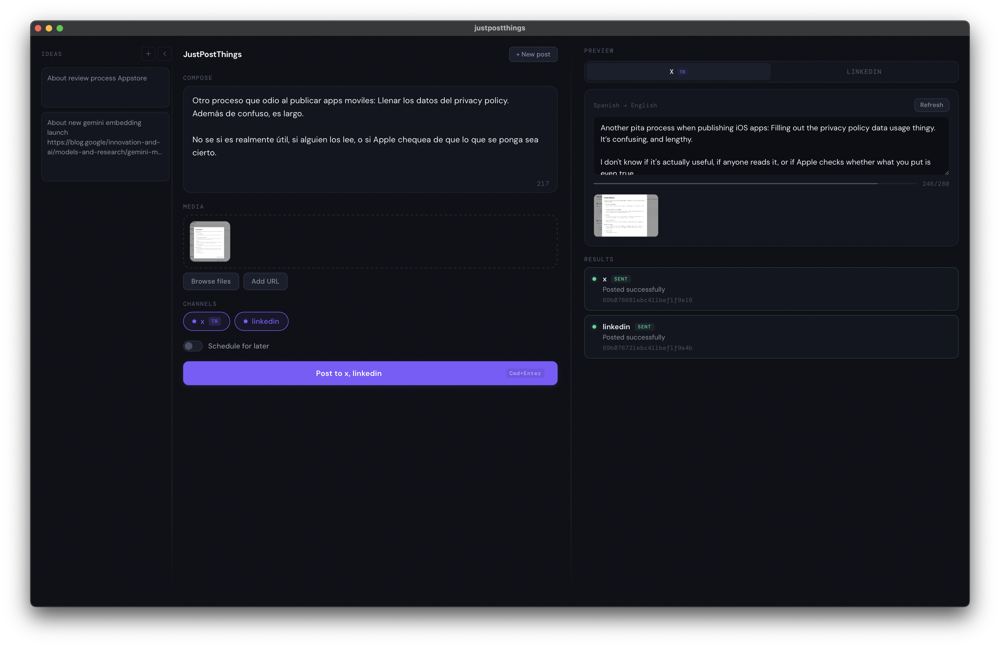

<p align="center">
  
</p>

<h1 align="center">JustPostThings</h1>

<p align="center">
  A Rust-powered tool for posting content to multiple social media platforms simultaneously via the <a href="https://buffer.com">Buffer</a> API.<br/>
  Available as both a <strong>CLI tool</strong> and a <strong>Tauri desktop app</strong> with a Svelte frontend.
</p>

<p align="center">
  <a href="LICENSE"></a>
</p>

<p align="center">
  
</p>

## Features

- Post text to multiple social media channels at once (X, LinkedIn)
- Attach multiple images (local files or URLs)
- Local images auto-uploaded to ImgBB
- Schedule posts for a specific date/time
- Per-channel text translation (Spanish → English, etc.)
- Editable translation previews before posting
- Configurable default channels
- Ideas panel for saving and managing post ideas with links
- Image lightbox for previewing attached images
- Desktop app with live preview and custom date/time picker
- Built-in Settings UI with form editor and raw JSON mode
- Config stored in app data directory — works from `/Applications`

## Architecture

Cargo workspace with three members:

```
justpostthings/
├── crates/
│   ├── justpostthings-lib/       # Shared library (business logic)
│   │   └── src/
│   │       ├── lib.rs            # Config types + loader
│   │       ├── buffer.rs         # Buffer GraphQL API
│   │       ├── imgbb.rs          # ImgBB image upload
│   │       ├── translation.rs    # TranslationService trait + factory
│   │       ├── openai_service.rs # OpenAI provider
│   │       ├── gemini_service.rs # Google Gemini provider
│   │       └── claude_service.rs # Claude API + CLI provider
│   └── justpostthings-cli/       # CLI binary (clap)
├── src-tauri/                    # Tauri v2 backend
│   └── src/
│       ├── main.rs               # App initialization
│       └── commands.rs           # IPC command handlers
└── ui/                           # Svelte 5 + Vite frontend
    └── src/
        ├── App.svelte
        ├── components/           # UI components
        │   ├── Settings.svelte       # Settings form + raw JSON editor
        │   ├── IdeasPanel.svelte     # Post ideas sidebar
        │   ├── ImageLightbox.svelte  # Image preview overlay
        │   └── ...
        └── lib/                  # Types, API wrappers, stores
```

## Prerequisites

- [Rust](https://www.rust-lang.org/tools/install) (edition 2021)
- [Node.js](https://nodejs.org/) (v20+)
- A [Buffer](https://buffer.com) account and API key
- An [ImgBB](https://imgbb.com/) API key (for local image uploads)

## Setup

1. Clone the repository:

   ```bash
   git clone <repo-url>
   cd justpostthings
   ```

2. Install dependencies:

   ```bash
   npm install
   cd ui && npm install
   ```

### CLI setup

3. Create a `.env` file in the project root:

   ```
   BUFFER_API_KEY=your_buffer_api_key
   IMGBB_API_KEY=your_imgbb_api_key
   ```

   Optional keys depending on your translation service:

   ```
   OPENAI_API_KEY=your_openai_key
   GEMINI_API_KEY=your_gemini_key
   ANTHROPIC_API_KEY=your_anthropic_key
   ```

4. Copy the example config and edit with your Buffer channel IDs:

   ```bash
   cp config.example.json config.json
   ```

   Edit `config.json`:

   ```json
   {
     "llm_service": {
       "provider": "claude-cli",
       "model": "sonnet"
     },
     "channels": [
       {
         "name": "x",
         "id": "your_buffer_channel_id",
         "should_translate": true,
         "translate": {
           "from": "Spanish",
           "to": "English"
         }
       },
       {
         "name": "linkedin",
         "id": "your_buffer_channel_id",
         "should_translate": false
       }
     ],
     "default_post_channels": ["x", "linkedin"]
   }
   ```

### Desktop app setup

3. On first launch, the Settings page opens automatically. Configure your API keys and channels from the UI (or use the "Edit JSON" toggle to paste raw config).

   The desktop app stores its configuration in the app data directory:

   ```
   ~/Library/Application Support/com.justpostthings.app/
   ├── config.json   # Same format as CLI config
   └── .env          # API keys
   ```

   You can also edit these files directly — they use the same format as the CLI.

## Desktop App

### Development

```bash
npm run tauri:dev
```

This starts the Vite dev server and launches the Tauri window with hot reload.

### Build

```bash
npm run tauri:build
```

Produces a native macOS `.app` bundle (or equivalent for your platform) in `src-tauri/target/release/bundle/`.

### UI Overview

Three-column layout:

- **Left sidebar**: Ideas panel for saving and managing post ideas with links — collapsible
- **Center column**: Post editor, image uploader (drag & drop or browse) with lightbox preview, channel selector, scheduler with custom date/time picker, post button
- **Right column**: Tabbed preview (one tab per selected channel), translation controls for channels with `should_translate`, posting results and status feedback

A gear icon in the header opens the **Settings** page, where you can configure API keys, channels, default channels, and LLM service. Toggle "Edit JSON" to edit the raw `config.json` directly.

## CLI

### Build

```bash
cargo build -p justpostthings-cli --release
```

### Usage

```bash
cargo run -p justpostthings-cli -- "Your post text" [OPTIONS]
```

### Options

| Option | Description |
|---|---|
| `<TEXT>` | Post text (required) |
| `--image <PATH_OR_URL>` | Image to attach (repeatable) |
| `--schedule <DATETIME>` | Schedule time (ISO 8601, e.g. `2025-03-15T10:00:00Z`) |
| `--channels <NAMES>` | Comma-separated channel names (overrides defaults) |
| `--config <PATH>` | Config file path (default: `./config.json`) |

### Examples

```bash
# Post to all default channels
cargo run -p justpostthings-cli -- "Check out my new project!"

# Post with local and remote images
cargo run -p justpostthings-cli -- "Launch day!" \
  --image /path/to/screenshot.png \
  --image https://example.com/banner.jpg

# Schedule a post
cargo run -p justpostthings-cli -- "Coming soon!" --schedule "2025-03-15T10:00:00Z"

# Post to specific channels
cargo run -p justpostthings-cli -- "X-only update" --channels x
```

## Translation Services

The app supports four translation providers, configured via `llm_service` in `config.json` (with `provider` and optional `model` fields):

| Service | Config Value | Model | Requires |
|---|---|---|---|
| OpenAI | `openai` | gpt-4o-mini | `OPENAI_API_KEY` |
| Google Gemini | `gemini` | gemini-2.0-flash | `GEMINI_API_KEY` |
| Claude API | `claude-api` | claude-sonnet-4-20250514 | `ANTHROPIC_API_KEY` |
| Claude CLI | `claude-cli` | (local) | `claude` CLI installed |

Each channel can independently enable translation with its own source/target language pair. Translations are previewed and editable in the desktop app before posting.

## Environment Variables

| Variable | Required | Description |
|---|---|---|
| `BUFFER_API_KEY` | Yes | Buffer API token |
| `IMGBB_API_KEY` | Yes | ImgBB API key for image uploads |
| `OPENAI_API_KEY` | If using OpenAI | OpenAI API key |
| `GEMINI_API_KEY` | If using Gemini | Google Gemini API key |
| `ANTHROPIC_API_KEY` | If using Claude API | Anthropic API key |

## Tech Stack

- **Rust** + Tokio, reqwest, serde, clap
- **Tauri v2** with dialog and filesystem plugins
- **Svelte 5** with runes (`$state`, `$derived`, `$effect`)
- **Vite 6** for frontend bundling
- **TypeScript** for frontend type safety
